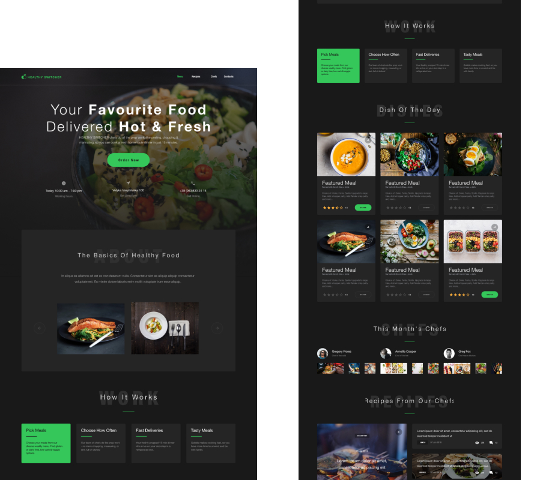

<h1 align="center">Healthy-switcher</h1>

    The "Healthy Switcher" web page project is a comprehensive resource for individuals looking to improve their health and wellbeing. The project utilizes a combination of HTML, CSS, JavaScript, SCSS, and markdown to create a visually appealing and user-friendly website.

    The design of the page is clean and modern, with a focus on simplicity and user-friendliness. The color scheme primarily consists of shades of green, associated with health and wellness, and white. The layout of the page is easy to navigate with the use of clear headings and contrasting colors for different sections. High-quality images and graphics are used throughout the page to add visual interest and break up the text.

 
 

